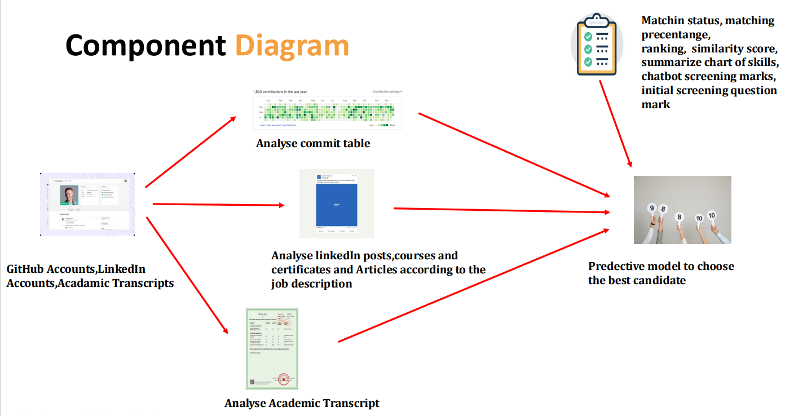

# Hewamadduma N.A
Module to calculate GitHub commit Frequency and consistency and assign Marks 

## Component Diagram

### Main Objective
* develop an automated system for comprehensive candidate screening and evaluation using LinkedIn profiles, GitHub activity, and academic transcripts.

### Sub Objectives
* Extract and analyze profile data, posts, and recommendations to assess professional engagement and skills.
* Analyze the frequency and consistency of commits to evaluate coding habits and project involvement.
* Match coursework with job descriptions, focusing on relevant modules and practical skills.
* Integrate the analyzed data to create a model that predicts the most suitable candidates for selection

